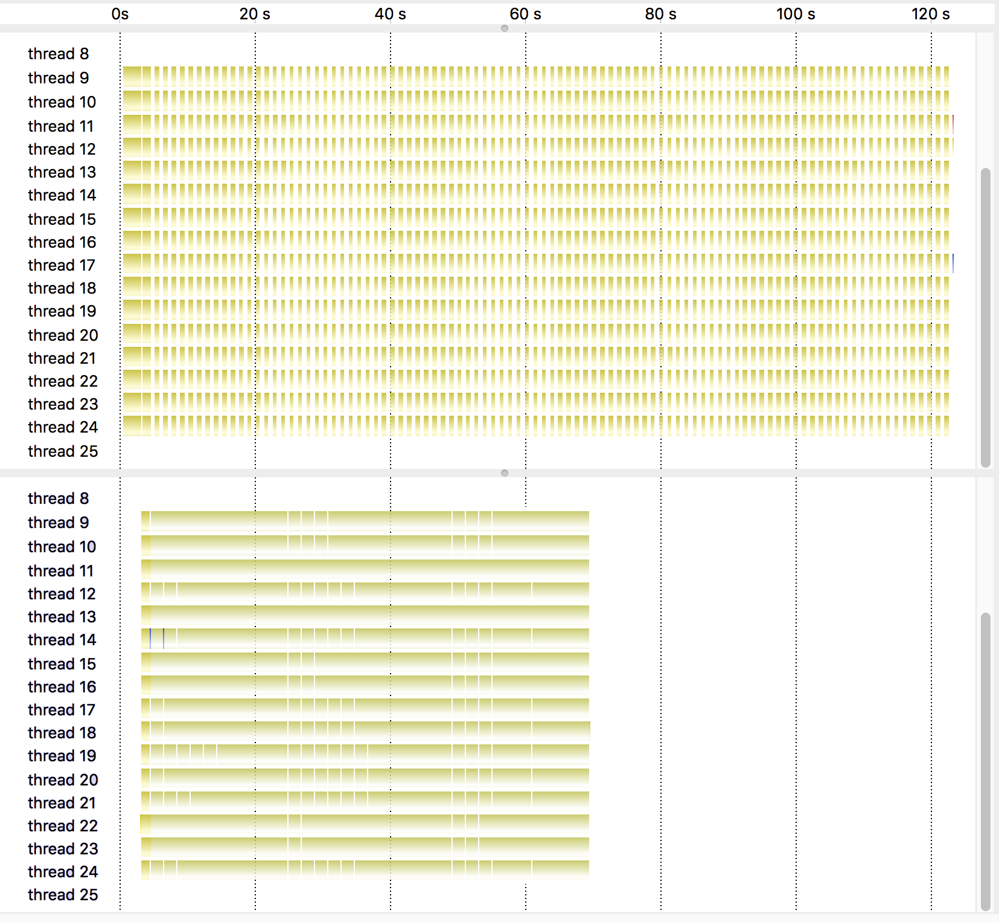

```
Document number: P0361R1
Date: 20161015
Project: Programming Language C++, SG14, SG1, Library Evolution WG
Authors:
    Hartmut Kaiser
    Thomas Heller
    Bryce Adelstein Lelbach
    John Biddiscombe
    Michael Wong
Emails:
    hartmut.kaiser@gmail.com
    thomas.heller@cs.fau.de
    balelbach@lbl.gov
    biddisco@cscs.ch
    michael@codeplay.com
Reply to: hartmut.kaiser@gmail.com
```

Changes from previous versions of this document

P0361R0

 * Renamed `parallel_vector_task_policy` to `parallel_unseq_task_policy`
   to match name changes in Parallelism TS
 * Added section discussing comments received since last revision of the paper
 * Added example to show benefits of futurization combined with asynchronous parallel algorithms


# Invoking Algorithms Asynchronously

## Introduction

This paper describes new execution policies enabling the asynchronous execution
of the parallel algorithms as defined by the Parallelism TS (N4507)[1]. This
paper is part of an effort to design and propose uniform parallelism APIs in C++
with the goal to make the language independent from any external solutions (such
as OpenMP or OpenACC). There have been several discussions in SG1 and SG14 during
the recent committee meetings in Kona and Jacksonville expressing interest in
enabling asynchronous execution of parallel algorithms.

This paper also continues the specific features and needs towards supporting
Heterogeneous Devices which was discussed in an evening session at
[Jacksonville 2016][2]. In that evening session, Michael Wong presented the
motivation to support Heterogeneous devices and how it has been done in OpenMP,
and was followed by two C++ specific designs. Hartmut Kaiser presented the HPX
design which caters more to a highperformance computing viewpoint. Lee Howes
presented the Khronos SYCL/OpenCL design which caters more to a consumer device
viewpoint. The discussion that followed, indicated enthusiastic support to move
C++ towards full support for Heterogeneous computing by 2020, likely through an
initial TS.

In general, all parallel algorithms as defined in N4507 are synchronous. This
means that the execution of an algorithm returns only after its operation has
completely finished. It is well known, that this form of fork/join parallelism
imposes an implicit barrier onto the parallel execution flow. This is also
currently the case in OpenMP parallel regions. This barrier impedes parallel
efficiency and efficient resource utilization of the used processing units as
the execution has to wait for the thread of execution which performs the necessary
join operation at the end of the execution of the algorithm.

The user has no means of controlling how and when this barrier is imposed and
also has no means of avoiding the resource starvation associated with it.
A possible remedy for this problem is to allow for the algorithms to be executed
asynchronously. While this does not remove the implicit barrier at the end of
the execution of any of the algorithms, it allows to reduce the resource
starvation by allowing to perform other, unrelated tasks while the join-operation
(and the associated tapering of parallel work) is being executed.

This paper proposes to enable such an asynchronous execution of all algorithms
as defined by N4507 by introducing special execution policies which essentially
launch the execution of the algorithm on a new thread of execution while the
algorithm invocation itself now returns a `std::future` representing the result
of its execution.

Returning a Future object from the algorithm has the additional advantage of
being able to integrate the parallel algorithms with other asynchronous codes
which also rely on representing their results through `std::future`. This is
especially important in light of the proposed additions to std::future as
described by the [Concurrency TS (4501)][3]. The proposed extensions have been
implemented in [HPX][4] which has an implementation of N4507. They are in use
in production codes for some time.

# Summary of the Proposed Functionality

An asynchronous execution policy is an object which fulfills the concept of an
execution policy as defined in N4507. Additionally it instructs a parallel
algorithm to launch its execution on a new thread of execution and changes the
algorithm to return a Future object representing the result of the execution of
the original algorithm.

We propose that every one of the already specified execution policies (`seq`,
`par`, and `par_unseq`) has a corresponding asynchronous execution policy which
is generated by `seq(task)`, `par(task)`, and `par_unseq(task)`.

With those extensions, the following use cases of the parallel algorithms
library are possible:

    using namespace std::experimental::parallel::v1;
    std::vector<int> data = { ... };

    // legacy standard sequential sort
    std::sort(data.begin(), data.end());
    // explicitly sequential sort
    sort(seq, data.begin(), data.end());
    // permitting parallel execution
    sort(par, data.begin(), data.end());
    // permitting vectorized execution as well
    sort(par_unseq, data.begin(), data.end());

    // NEW: asynchronous, sequential execution
    std::future<void> f1 = sort(seq(task), data.begin(), data.end());
    // ... perform other work
    f1.get(); // synchronize with the asynchronous sequential sort()

    // NEW: asynchronous execution, allow for parallelization of the algorithm
    std::future<void> f2 = sort(par(task), data.begin(), data.end());
    // ... perform other work
    f2.get(); // synchronize with the asynchronous parallel sort()

    // NEW: asynchronous execution, allow for parallelization and vectorization
    // of the algorithm
    std::future<void> f3 = sort(par_unseq(task), data.begin(), data.end());
    // ... perform other work
    f3.get(); // synchronize with the asynchronous parallel vectorized sort()

# Specification

Header `<experimental/execution_policy>` synopsis

The following definitions are being proposed to be added to this header file.

    namespace std {
    namespace experimental {
    namespace parallel {
    inline namespace v1 {
        // 3.1, Task modifier tag type for execution policies
        class task_execution_policy_tag {};

        // 3.2, Task modifier instance for execution policies
        constexpr task_execution_policy_tag task {};

        // 3.3, Asynchronous execution policy type trait
        template<class T> struct is_task_execution_policy;
        template<class T> constexpr
        bool is_task_execution_policy_v = is_task_execution_policy<T>::value;

        // 3.4, Sequential asynchronous execution policy
        class sequential_task_execution_policy;

        // 3.5, Parallel asynchronous execution policy
        class parallel_task_execution_policy;

        // 3.6, Parallel+Vector asynchronous execution policy
        class parallel_unseq_task_execution_policy;

        // 3.7, Generator function operators added to existing execution policies
        sequential_task_execution_policy
        sequential_execution_policy::operator()(task_execution_policy_tag) const;

        parallel_task_execution_policy
        parallel_execution_policy::operator()(task_execution_policy_tag) const;

        parallel_unseq_task_execution_policy
        parallel_unseq_execution_policy::operator()(task_execution_policy_tag) const;
    }
    }
    }
    }

## Task modifier tag type for execution policies

    class task_execution_policy_tag { unspecified };

1. `task_execution_policy_tag` is a unique type used to generate an asynchronous
   execution policy from its non-asynchronous counterpart

## Task modifier instance for execution policies
constexpr task_execution_policy_tag task{};
1 The header <experimental/execution_policy> declares a global object for the task modifier tag type.

## Asynchronous execution policy type trait

    template<class T> struct is_task_execution_policy { see below };

1. `is_task_execution_policy` can be used to detect parallel execution policies
    for the purpose of excluding function signatures from otherwise ambiguous
    overload resolution participation.
2. `is_task_execution_policy<T>` shall be a `UnaryTypeTrait` with a
    BaseCharacteristic of `true_type` if `T` is the type of a standard or
    implementation-defined asynchronous execution policy, otherwise `false_type`.

    *[Note: This provision reserves the privilege of creating nonstandard
            asynchronous execution policies to the library implementation.
    end note]*
3.  The behavior of a program that adds specializations for
    `is_task_execution_policy` is undefined.

## Sequential asynchronous execution policy

    class sequential_task_execution_policy { unspecified };

1.  The class `sequential_task_execution_policy` is an asynchronous execution
    policy type used as a unique type to disambiguate asynchronous parallel algorithm
    overloading and require that a parallel algorithm's execution may not be
    parallelized, that the algorithm should be executed asynchronously, and that
    the return type of the algorithm should be a `future<T>`, where `T` is the
    type as returned by the non-asynchronous version of the same algorithm.

## Parallel asynchronous execution policy

    class parallel_task_execution_policy { unspecified };

1.  The class `parallel_task_execution_policy` is an asynchronous execution
    policy type used as a unique type to disambiguate asynchronous parallel
    algorithm overloading and indicate that a parallel algorithm's execution may
    be parallelized, that the algorithm should be executed asynchronously, and
    that the return type of the algorithm should be a `future<T>`, where `T`
    is the type as returned by the non-asynchronous version of the same algorithm.

## Parallel+Vector asynchronous execution policy

    class parallel_vector_task_execution_policy { unspecified };

1.  The class `parallel_vector_task_execution_policy` is an asynchronous
    execution policy type used as a unique type to disambiguate asynchronous
    parallel algorithm overloading and indicate that a parallel algorithm's
    execution may be vectorized and parallelized, that the algorithm should be
    executed asynchronously, and that the return type of the algorithm should
    be a `future<T>`, where `T` is the type as returned by the nonasynchronous
    version of the same algorithm.

## Generator function operators added to existing execution policies

Every of the non-asynchronous execution policies as defined by N4507 has an
added function operator used to generate a corresponding asynchronous execution
policy.

    sequential_task_execution_policy
    sequential_execution_policy::operator()(task_execution_policy_tag) const;

    parallel_task_execution_policy
    parallel_execution_policy::operator()(task_execution_policy_tag) const;

    parallel_vector_task_execution_policy
    parallel_vector_execution_policy::operator()(task_execution_policy_tag) const;

# Exception Handling

All behavior regarding generating exceptions is unchanged from the Parallelism
TS except that none of the algorithms shall directly throw any of the generated
exceptions if invoked with an asynchronous execution policy but deliver the
exception through the returned future object.

# Examples

## Asynchronous Gather Algorithm

Given a synchronous algorithm gather:

    template <typename BiIter, typename Pred>
    pair<BiIter, BiIter>
    gather(BiIter f, BiIter l, BiIter p, Pred pred)
    {
        BiIter it1 = stable_partition(f, p, not1(pred));
        BiIter it2 = stable_partition(p, l, pred);
        return make_pair(it1, it2);
    }

the following example demonstrates how the proposed features can be used to
compose more complex asynchronous algorithms. The gather algorithm is meant to
collect all elements in a given range `[f, l)` at the given position `p` for
which a given boolean predicate `pred` is true. The implementation above
achieves that by invoking `stable_partition` twice, once for all elements in
the range `[f, p)` while using the inverted predicate, and once for the elements
in the range `[p, l)` using the predicate as is. The algorithm `gather` returns
a pair of iterators marking the range of the newly inserted elements.

The asynchronous version of the same algorithm (here `gather_async`), is
called using the same arguments, it however returns a future to the pair of
result iterators.

    template <typename BiIter, typename Pred>
    future<pair<BiIter, BiIter>>
    gather_async(BiIter f, BiIter l, BiIter p, Pred pred)
    {
        future<BiIter> f1 = stable_partition(par(task), f, p, not1(pred));
        future<BiIter> f2 = stable_partition(par(task), p, l, pred);
        return when_all(f1, f2).then(
            [](tuple<future<BiIter>, future<BiIter>> p)
            {
                return make_pair(get<0>(p).get(), get<1>(p).get());
            }
        );
    }

The benefit of calling the asynchronous versions of the `stable_partition`
algorithms is twofold:  a) both subregions can be handled concurrently, and b)
the overall algorithm can be made asynchronous.

The only caveat of this implementation is the slightly complicated code necessary
to convert the pair of futures into a future of pairs using when_all().then()
(as proposed by the Concurrency TS).

However, by using `co_await` (see [P0057R3][5]), this can be further simplified:

    template <typename BiIter, typename Pred>
    future<pair<BiIter, BiIter>>
    gather_async(BiIter f, BiIter l, BiIter p, Pred pred)
    {
        future<BiIter> f1 = stable_partition(par(task), f, p, not1(pred));
        future<BiIter> f2 = stable_partition(par(task), p, l, pred);
        co_return make_pair(co_await f1, co_await f2);
    }

Please note, that the version using co_await is 100% semantically equivalent to
the asynchronous version using when_all().then() .

## Halo exchanges

In scientific computing, a very common paradigm to compute solutions for physical
problems is known as "Halo Exchange". This means, that a computational domain is
partitioned into various subdomains. In order to compute solutions to that problem,
information on the neighboring cells is needed (similar to a linear filter, for
example a Gaussian Blur). In pseudo code this looks a little bit like this:

    exchange_halos();
    compute_boundaries();
    compute_interior();

The compute related functions can be expressed in terms of parallel algorithms (for example `std::transform` or the proposed `std::for_loop`. The halo exchanges consist of some form of network communication. By allowing all three presented functions to return a future signalling the completion of the operation. It is triviall to overlap communication with computation:

    std::future<void> halo_done = halo_exchange();
    std::future<void> boundaries_done = halo_done.then(
        [&](auto done){ return compute_boundaries(); });
    std::future<void> interior_done = compute_interior();
    
    // Signal completion of the complete update
    return std::when_all(boundaries_done, interior_done);

In order to effectively have the computation/communication overlap in this example, it is important that all three operations are able to make progress independent of each other, while the user explicitly defines the dependency between the halo exchange and the boundaries update, as mandated by the algorithm at hand.

The effect of this futurization of the algorithm can be observed here:



The upper part of the picture shows the execution of the first, non-futurized version. While the `compute` functions are using the synchronous parallel algorithms, you can still see the effect that there are "holes" in the program execution which means that no work can be done due to no overlapping. At the bottom, all the holes are filled with useful work since the dependencies are expressed in a finer grained fashion and communication and computation are able to be overlapped perfectly.

### TODO: Can the same be accomplished with suspendable functions? How would it look like?

The complete example can be found at [6].

# Discussion

During several rounds of discussion, both at the meeting in Oulu and in various
phone calls since then people have brought up a couple of points to be discussed
here.

1.  Use separate overloads for asynchronous algorithms instead of new execution
    policies

    #TODO: discuss response

2.  Do not introduce asynchronous algorithms now as those may be subsumed by
    core language functionalities (such as `suspendable` functions, see
    [#TODO: Thorvald's paper][6]) which are currently proposed and under
    discussion.

    #TODO: discuss response
    
3.  Progress guarantees for async parallel algorithms

# References
[1] N4507, Technical Specification for C++ Extensions for Parallelism, (ed) J.
Hoberock, http://www.openstd.org/jtc1/sc22/wg21/docs/papers/2015/n4507.pdf

[2] P00234R0: Towards Massive Parallelism (aka Heterogeneous Devices/Accelerator/GPGPU)
support in C++ with HPX, Michael Wong, Hartmut Kaiser, Thomas Heller,
http://www.openstd.org/jtc1/sc22/wg21/docs/papers/2016/p0057r3.pdf

[3] N4501, Working Draft, Technical Specification for C++ Extensions for
Concurrency, (ed) A. Laksberg, http://www.openstd.org/jtc1/sc22/wg21/docs/papers/2015/n4501.html

[4] HPX: A general purpose C++ runtime system for parallel and distributed
applications of any scale, https://github.com/STEllARGROUP/hpx.

[5] P0057R3: Wording for Coroutines, Gor Nishanov, Jens Maurer, Richard Smith,
Daveed Vandevoorde, http://www.openstd.org/jtc1/sc22/wg21/docs/papers/2016/p0057r3.pdf

[6] #TODO: add reference

[7] HPX Stencil Example, https://github.com/STEllAR-GROUP/tutorials/tree/master/examples
